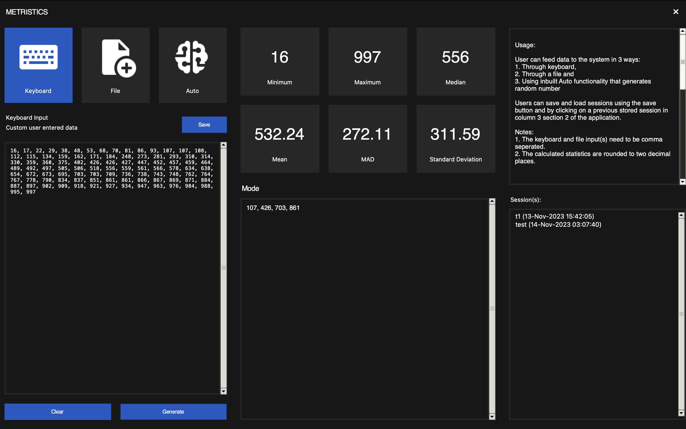
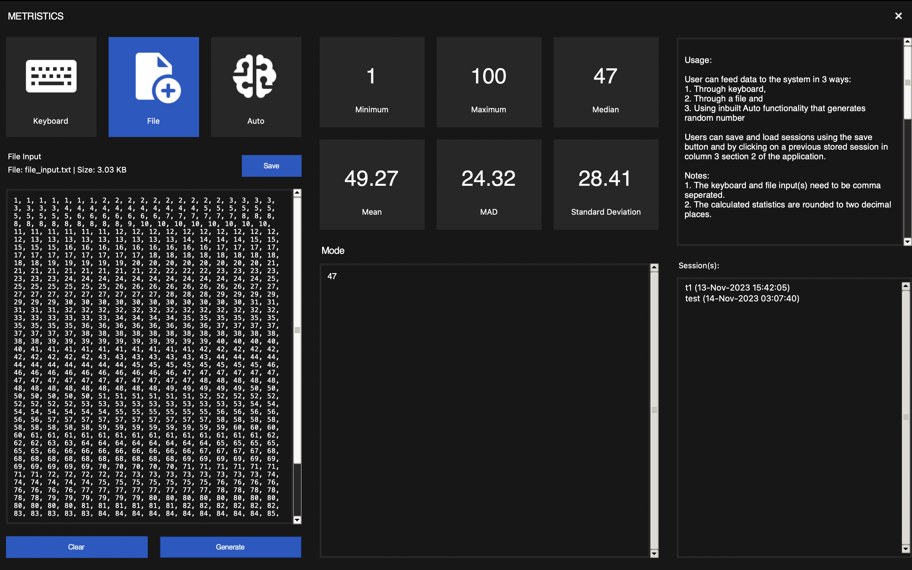
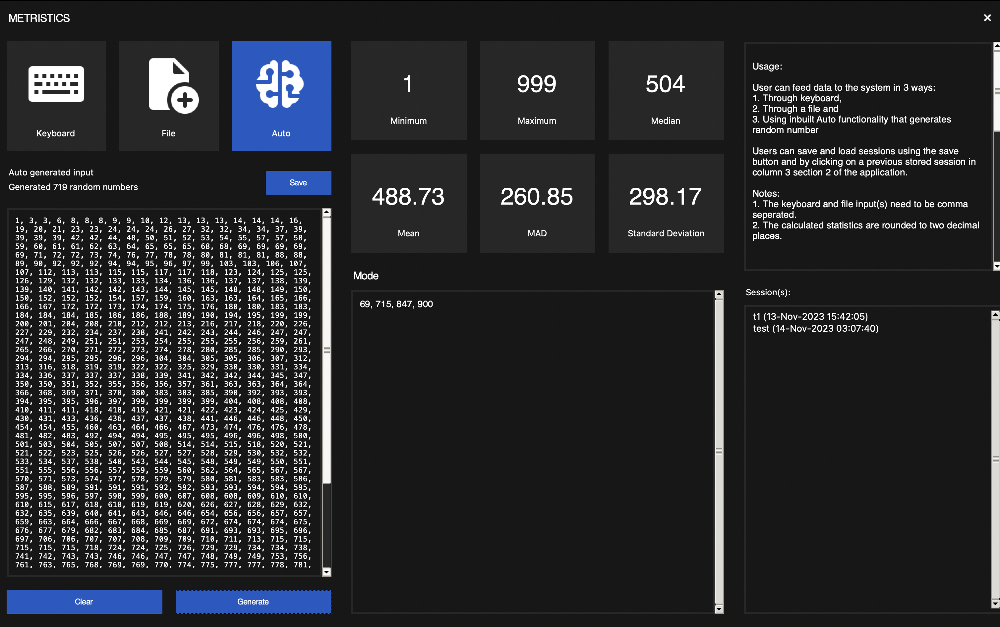

# METRICSTICS: Your Statistical Calculator 📊


Welcome to METRICSTICS, a Python-based statistical calculator with a sleek Tkinter GUI. METRICSTICS not only computes standard statistical measures but also provides an intuitive interface for loading and storing session information. It features a beautiful dark theme, ensuring a pleasant user experience.


## Table of Contents
- [Introduction](#introduction)
- [Features](#features)
- [Getting Started](#getting-started)
  - [Prerequisites](#prerequisites)
  - [Installation](#installation)
- [Usage](#usage)
- [Contributing](#contributing)
- [License](#license)

## Introduction

Provide a brief introduction to your project. Mention its purpose, features, and any other relevant information.

## Features

- Calculate statistics: min, max, mean, median, mode, mad, and standard deviation.
- User-friendly GUI built with Tkinter.
- A sleek dark theme for a modern and comfortable user experience.
- Input data through keyboard, file upload, or the interactive randomizer button.
- Convenient session management – store and load your statistical sessions effortlessly.
- Follows the Model-View-Controller (MVC) design pattern for a clean and modular code structure.

## Screenshots


*METRICSTICS GUI - Keyboard*


*METRICSTICS GUI - File upload*


*METRICSTICS GUI - Auto (Randomizer)*

## Getting Started

### Prerequisites

Make sure you have Python 3.11.5 installed on your system. If not, download and install it from [python.org](https://www.python.org/).

### Installation

1. Clone the repository:
```bash
git clone https://github.com/your-username/metricstics.git
```
2. Navigate to the project directory:
cd metricstics

3. Install dependencies:
pip install -r requirements.txt

## Usage
Run the following command to start METRICSTICS:
python main.py

## Contributors

Thank you to the following contributors for their valuable contributions to the project:

- [Huzaifa Anjum](https://github.com/huzaifafcrit)
- [Anagha Harinath](https://github.com/Anagha630)
- [Srikar Hasthi](https://github.com/SrikarHasthi)
- [Sameer Kamble](https://github.com/sameer1130)
- [Madiha Itrat](https://github.com/MadihaMehdi)

Your efforts are greatly appreciated! 🙌

## Contributing

We welcome contributions! If you would like to contribute to METRICSTICS, please read our [contribution guidelines](CONTRIBUTING.md).

## License

This project is licensed under the MIT License - see the LICENSE file for details.

## Acknowledgements

- A big thanks to the Python community and the Tkinter team for making METRICSTICS possible.
- Special thanks to Professor [Mr. Pankaj Kamthan](kamthan@gmail.com) for guidance and support.